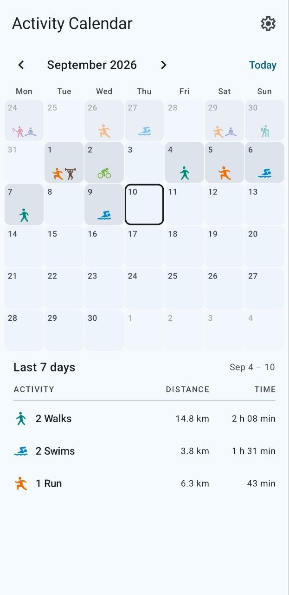
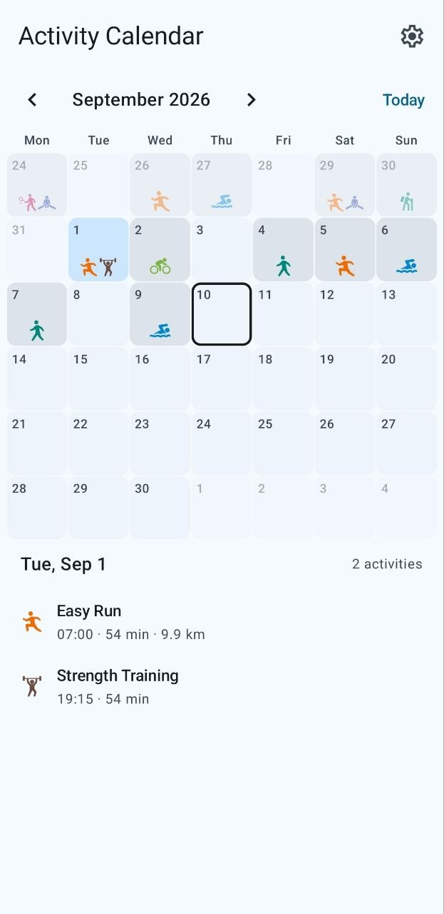
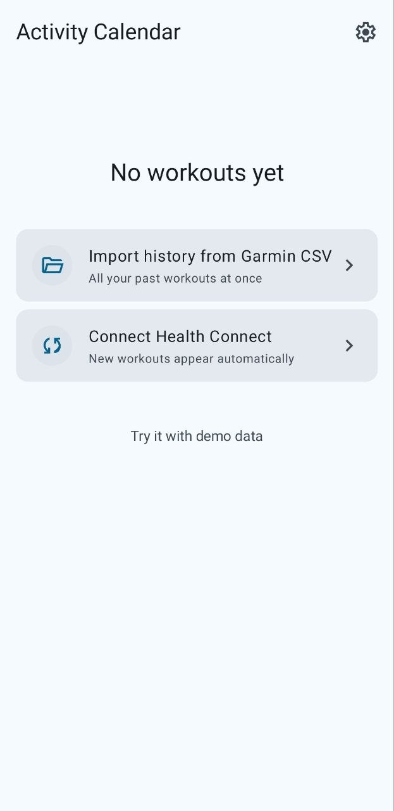
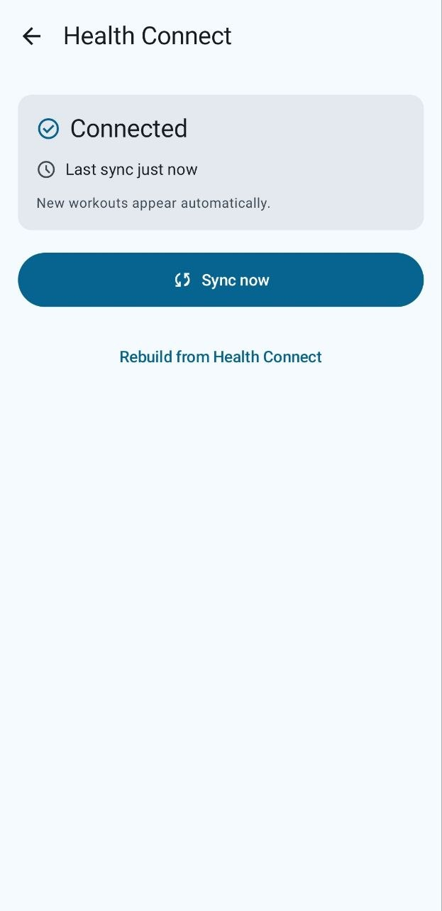
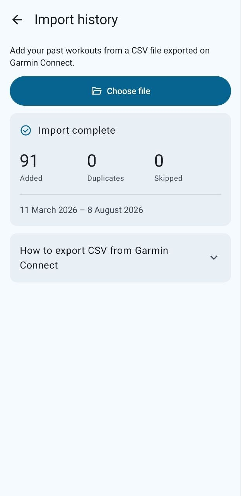
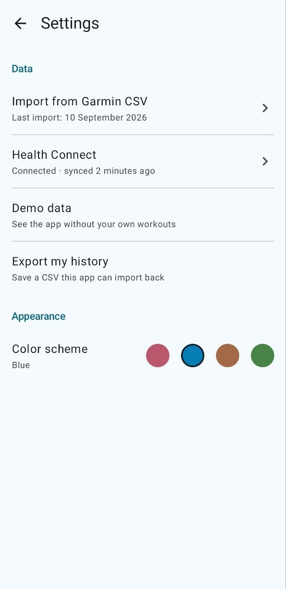

# Activity Calendar

A month calendar of workouts from a Garmin watch: the type of every session is readable
at a glance, for any month of any year.

[](https://github.com/jaaliska/ActivityCalendar/actions/workflows/ci.yml)

**An AI-first project.** The code is written by Claude Code. The author decides what to build
and in which order, makes the architecture calls, writes the documents in [`docs/`](docs/)
that the agent works from, and reviews every change.

## Why

Strava has a month calendar with activity icons, which is a good way to see how a week went —
but it cannot be paged back. Garmin Connect keeps the whole history, yet the types of workouts
are not told apart visually, so a month of training reads as a list, not as a shape.

This app takes the useful half of each: the calendar of Strava, the history of Garmin.

## Screenshots

| Month and the last seven days | A picked day | First run |
|---|---|---|
|  |  |  |

| Health Connect | Import | Settings |
|---|---|---|
|  |  |  |

## Where the workouts come from

| Source | What it gives |
|---|---|
| Health Connect | New workouts, on their own: in the background and at every opening of the app |
| CSV from the Garmin Connect website | The history from before Health Connect was connected |
| Demo data | Sample workouts for anyone with neither a watch nor an export |

## Built with

Kotlin, Jetpack Compose, Room, Health Connect, WorkManager, DataStore, navigation-compose.
Minimum Android 9 (API 28) — the Health Connect app does not exist below it.

- **Why these data sources and not the Garmin API** ([ADR-001](docs/adr/ADR-001-data-source.md)).
- **MVVM with one immutable `UiState` per screen** ([ADR-002](docs/adr/ADR-002-presentation-layer.md)).
- **Manual dependency container instead of a DI framework** ([ADR-003](docs/adr/ADR-003-navigation-and-dependencies.md)).
- **Ports in `domain`, implementations in `data`, use cases where there is logic to hold**
  ([ADR-004](docs/adr/ADR-004-use-cases.md)).
- Unit tests, lint and a debug build run in CI on every push.

## Build

Needs JDK 21.

```bash
./gradlew test lint assembleDebug
```

## Documentation

The design and decision documents are in Russian, in [`docs/`](docs/):

- [milestone-dev-plan.md](docs/plan/milestone-dev-plan.md) — what is built, in what order, and why.
- [mvp-backlog.md](docs/mvp-backlog.md) — user stories with acceptance criteria.
- [data-model-notes.md](docs/data-model-notes.md) — the fields of every source and the domain model.
- [data-sources.md](docs/data-sources.md) — where the data comes from and when there is none.
- [ux/](docs/ux/) — information architecture, theme, mockups.
